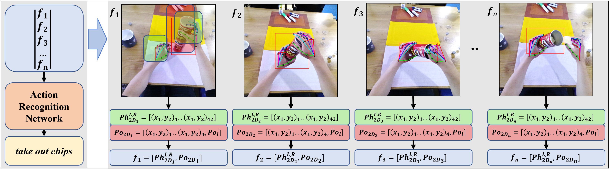

# In My Perspective, In My Hands: Accurate Egocentric 2D Hand Pose and Action Recognition


[](https://arxiv.org/abs/2404.09308)

>Action recognition is essential for egocentric video understanding, allowing automatic and continuous monitoring of Activities of Daily Living (ADLs) without user effort. Existing literature focuses on 3D hand pose input, which requires computationally intensive depth estimation networks or wearing an uncomfortable depth sensor. In contrast,  there has been insufficient research in understanding 2D hand pose for egocentric action recognition, despite the availability of user-friendly smart glasses in the market capable of capturing a single RGB image. Our study aims to fill this research gap by exploring the field of 2D hand pose estimation for egocentric action recognition, making two contributions. Firstly, we introduce two novel approaches for 2D hand pose estimation, namely EffHandNet for single-hand estimation and EffHandEgoNet, tailored for an egocentric perspective, capturing interactions between hands and objects. Both methods outperform state-of-the-art models on H2O and FPHA public benchmarks. Secondly, we present a robust action recognition architecture from 2D hand and object poses. This method incorporates EffHandEgoNet, and a transformer-based action recognition method. Evaluated on H2O and FPHA datasets, our architecture has a faster inference time and achieves an accuracy of 91.32\% and 94.43\%, respectively, surpassing state of the art, including 3D-based methods. Our work demonstrates that using 2D skeletal data is a robust approach for egocentric action understanding. Extensive evaluation and ablation studies show the impact of the hand pose estimation approach, and how each input affects the overall performance.

# Model weights
Please make a folder "saved_models" in the main repository and place there downloaded model [weights](https://cloud.cvl.tuwien.ac.at/s/WHr7M7zHgL6Xakm).


# To run action recognition on H2O and test 2d pose:
It requires first generating predicted skeletons and object detection:
1. Running your own Yolo detections or MMPose/Mediapipe hand pose estimation requires installing additional packages. Please follow the original instructions.
2. To avoid installing additional packages, we provide predicted Yolo objects that can be downloaded. Place the folder under yolov7_pred/.. in the main repository.:

[Yolo-Train](https://cloud.cvl.tuwien.ac.at/s/jarkAmnNpAoXSW4);
[Yolo-Val](https://cloud.cvl.tuwien.ac.at/s/5CNHSA6FBHkrtpP);
[Yolo-Test](https://cloud.cvl.tuwien.ac.at/s/GQBM2tDc8Kjam26)

3. Run the code below to generate Yolo files in your dataset and pose predicted with EffHandEgoNet. The code calculates hand pose errors:

```bash
python get_h2o_egocentric_predictions.py --model_type effhandegonet --device cuda --data_type test --save_pose False --save_yolo_objects True --dataset_path "path_to_dataset"
```
4. Finally run the action recognition:
```bash
python train_action.py -c cfgs/test_h2o_actions.yaml

``` 
# To run action recognition on FPHA and test 2d pose:
1. Run the code to generate pose and object information:
```bash
python train.py -c cfgs/config_fphab.yaml
```
2. After generating pose and object information run:
```
python train_action.py -c cfgs/test_fpha_actions.yaml
```

# Bibtex

If you find this work useful or the models in your research or applications, please cite the paper using this BibTeX

```BibTeX
@article{mucha2024my,
  title={In My Perspective, In My Hands: Accurate Egocentric 2D Hand Pose and Action Recognition},
  author={Mucha, Wiktor and Kampel, Martin},
  journal={arXiv preprint arXiv:2404.09308},
  year={2024}
}
```